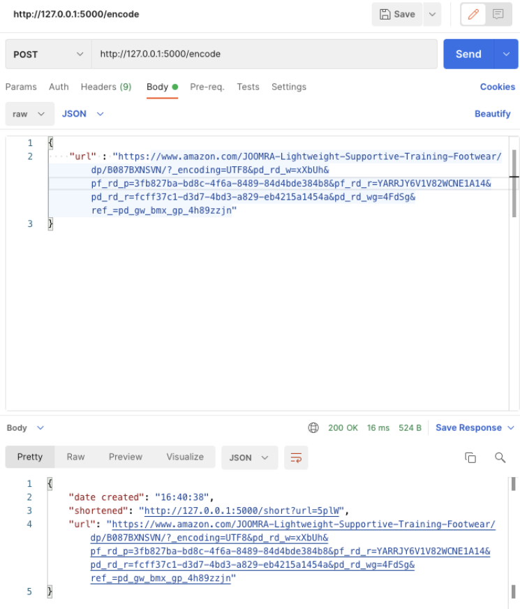
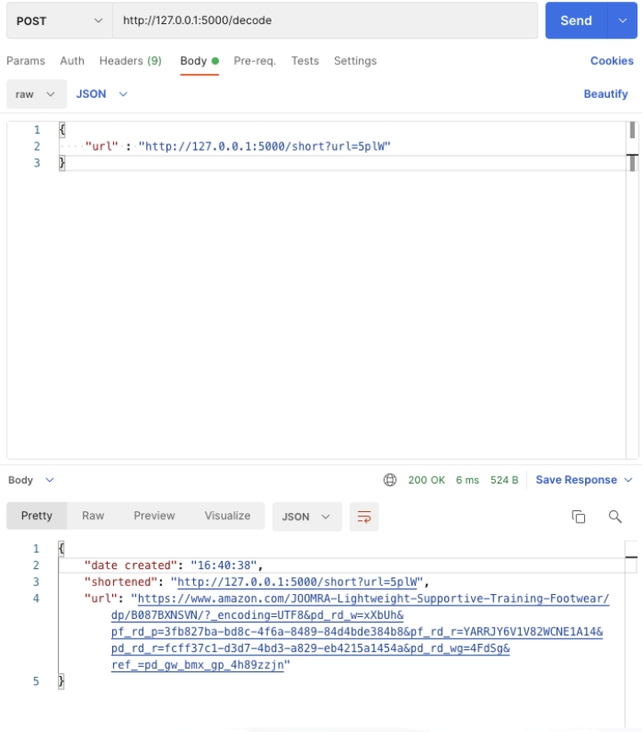

# Url shortener 
## Features
- [x] /encode - encodes a url to a shortened URL
- [x] /decode - decodes a shortened URL to its original URL
- [x] both endpints return JSON

## How to run
- Install the requirements from the requirements.txt: `pip install -r requirements.txt`
- start up the server: `python -m flask run`
- select any API testing application which can be used to test HTTP requests
- to encode a url, make a POST request to '/encode'. The request body should contain a JSON object in the format {"url": "<website_url>"}
	- After encoding, a JSON object will be returned. clicking on the "shortened", or pasting the shortened url in your web browser will redirect to the original url
- to decode a url, make a POST request to '/decode'. The request body should contain a JSON object in the format {"url": "<website_url>"}
	- After decoding a JSON object will be returned, in the same format as the one returned by encode.
- To view all encoded urls, make a GET request to '/stored'
## Screenshots
- encode
	- 
- decode
	- 

## Notes
- the urls are not persisted in a database. Resetting the server would reset the short urls. 
